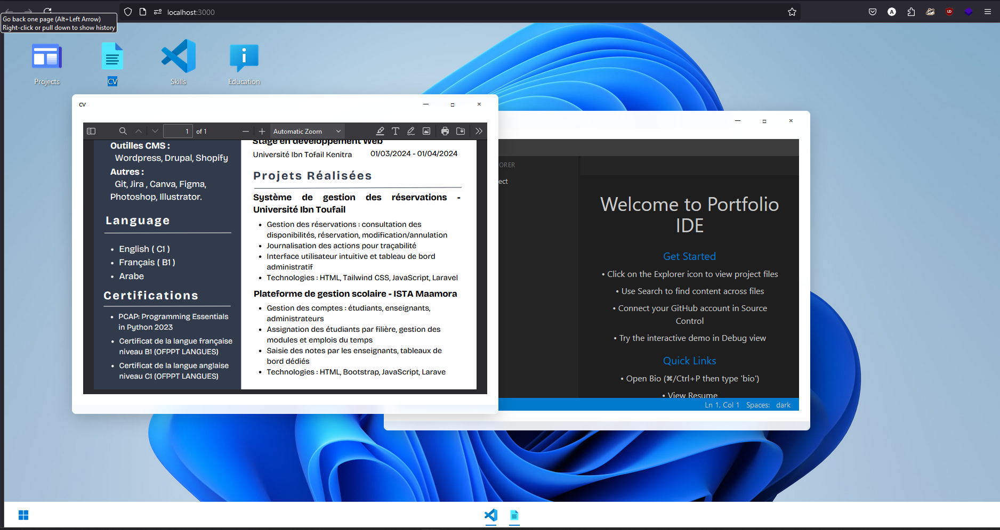

# Windows 11 Portfolio

A creative portfolio website that mimics the Windows 11 interface, featuring a VS Code-inspired viewer for displaying projects and information.

## 🌟 Live Demo
[Live Demo Link](https://windows-folio.vercel.app/) <!-- Add your deployed site link here -->

## 📸 Preview
 <!-- Add a screenshot of your portfolio -->

## 🚀 Features

- Windows 11-inspired interface
- Interactive desktop environment
- VS Code-style project viewer
- PDF Resume viewer
- Taskbar functionality
- Start menu
- Window management (minimize, maximize, close)
- Draggable windows

## 🛠️ Built With

- React.js
- Tailwind CSS
- React Draggable
- React Syntax Highlighter

## 🏗️ Installation


1. Clone the repository:
```sh
git clone https://github.com/aymane-fast/windows-folio.git
```

2. Install dependencies:
```sh
npm install
```

3. Start the development server:
```sh
npm start
```

4. Build for production:
```sh
npm run build
```

## 🎨 Customization

1. Replace `/public/resume.pdf` with your own CV
2. Update content in `src/content/` directory
3. Modify icons in `public/icons/` directory
4. Adjust themes in `src/contexts/ThemeContext.jsx`

## 🤝 Credits

- VS Code wonderful interface clone developed by this  guy [Ayman Faik](https://github.com/aymanbest)
- Thank you to [Ayman Faik](https://github.com/aymanbest) for the  VS Code interface clone wont be possible without him
- Windows 11 design inspiration from Microsoft

## 📝 License

This project is under a Modified MIT License:
- ✅ Free to use, modify, and distribute
- ✅ Can be used in private and commercial projects
- ✅ No attribution needed for personal/non-commercial use
- ℹ️ Commercial use requires attribution and link to original repository

See the [LICENSE](LICENSE) file for details.

VS Code interface clone credit: [Ayman Faik](https://github.com/aymanbest)

## 👤 Author

**Your Name**
- GitHub: [https://github.com/aymane-fast](#)
- LinkedIn: [https://www.linkedin.com/in/aymane-bahlouli-1220692a4/](#)
<!-- - Portfolio: [Your Portfolio](#) -->

## 🤝 Contributing

Contributions, issues, and feature requests are welcome!

1. Fork the Project
2. Create your Feature Branch (`git checkout -b feature/AmazingFeature`)
3. Commit your Changes (`git commit -m 'Add some AmazingFeature'`)
4. Push to the Branch (`git push origin feature/AmazingFeature`)
5. Open a Pull Request

## ⭐️ Show your support

Give a ⭐️ if you like this project!

## 📞 Contact

For any questions or inquiries, please reach out to:
- Email: [aymanebahlouli@gmail.com](#)

<!-- ## 🔮 Future Features

- [ ] Terminal emulator
- [ ] File explorer functionality
- [ ] Theme customization
- [ ] More interactive desktop widgets
- [ ] Mobile responsive design

## 🐛 Known Issues

Please check the [issues page](issues/) for any reported bugs or feature requests.

## 📄 Changelog

See [CHANGELOG.md](CHANGELOG.md) for a list of changes and updates. -->